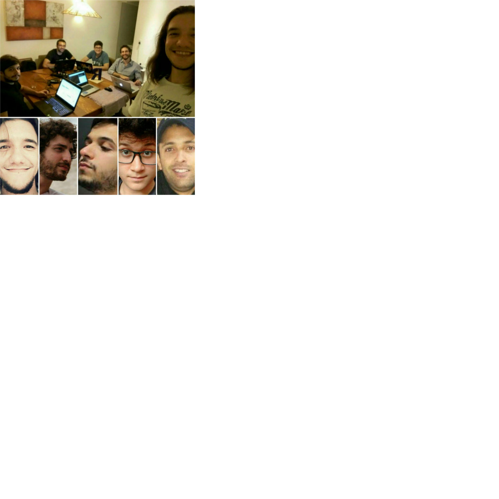

```{r setup, include=FALSE}
knitr::opts_chunk$set(echo = TRUE)
```

## Curso-R

- Athos Damiani
- Caio Lente
- Daniel Falbel
- Fernando Correa 
- Julio Trecenti
- William Amorim

## Curso-R

```{r, echo=FALSE, fig.align='center', fig.width=4, fig.height=4}

```

## Ciência de dados

```{r, echo=FALSE, fig.align='center', fig.width=4, fig.height=4}
knitr::include_graphics("bigdata2.png")
```


## Papel do R

R é a grande cola.

**Exemplo:** Tensorflow, feito em Python, chamado no R pelo pacote keras.

```{r, eval = FALSE}
library(keras)

modelo <- keras_model(input = 1)
```


## Nosso curso

17/03 - Introdução 

17/03 - Manipulação: `dplyr`, `tidyr`

24/03 - Visualização: `ggplot2`

24/03 - Case

## Nosso curso

Nosso curso baseia-se no livro *R for data science*:

http://r4ds.had.co.nz

## Ciclo da ciência de dados

```{r, echo=FALSE}
knitr::include_graphics("https://raw.githubusercontent.com/hadley/r4ds/master/diagrams/data-science.png")
```

## Nosso curso

O material do curso está disponível nessa página:

http://material.curso-r.com/

Também temos um blog:

http://curso-r.com/blog/

## Dinâmica das aulas

- Almoço às ~12h.
- Aulas expositivas em blocos de 3h.
- Exercícios ao decorrer e no final das aulas.
- Leituras e exercícios complementares fora da sala de aula.


## Diferenças entre C/C++ e R

- `C`: eficiência e transparência.
- `R`: análise de dados e interatividade. 

Isso faz com que as duas linguagens sejam bem diferentes!

Na prática, temos que

- C é compilável, R é uma linguagem script.
- R é uma linguagem funcional. Por exemplo, `(`, `&` e `+` são funções do R.


## Diferenças entre C/C++ e R

- R é vetorizado. Observe:

```{r}
a <- c(1, 2, 3)
b <- c(1, 2, 3, 4, 5, 6)
a + b 
```

Você raramente usará loops (`for`, `while`) no R.


## Tidyverse

O universo arrumadinho.

Revolução do R. Quem mexia em R antes de 2012 nota uma diferença gigante.

```{r, echo=FALSE}
library(magrittr)
knitr::include_graphics("abc.jpg")
# magick::image_read("https://pbs.twimg.com/media/CvzEQcfWIAAIs-N.jpg") %>%
#   magick::image_scale("400x400+8-8") %>%
  # magick::image_write("abc.jpg")
```

## Princípios do tidyverse

- *Eficiência algorítmica vs eficiência de trabalho*. O tempo gasto pensando em como realizar uma operação é mais importante do que o tempo que o computador gasta para realizar um cálculo.

- *Tidy data*. Princípio para arrumação de base de dados que resolve 90% dos problemas reais. Base tidy:
    - Cada observação é uma linha do bd.
    - Cada variável é uma coluna do bd.
    - Cada dado está numa célula do bd.


## Princípios do tidyverse

- Utilização do operador *pipe*: `%>%`.

    > "No matter how complex and polished the individual operations are, it is often the quality of the glue that most directly determines the power of the system."  
    > -- Hal Abelson

## Estrutura do tidyverse

- *Aparato mnemônico*. Pacotes baseados em teoria e API consistentes.

- *Minimalidade e funções puras*. Funções sem efeitos colaterais. Inputs e Outputs consistentes. Encaixa perfeitamente com o uso do pipe (%>%).

- *Procedimentos* para ciência de dados.

## GitHub

- Maior plataforma online para compartilhar códigos. 
- Utiliza o **Git**, a melhor ferramenta de versionamento de software.

*Vantagens*:

1. Boa prática de organizar projetos pois mantém os códigos organizados e atualizados na web.

2. Projetos colaborativos: aumenta a produtividade e permite que pessoas de todo lugar ajudem nos projetos. 

3. O `tidyverse` só é o que é hoje por conta do *social coding*.


## GitHub

Um tutorial para começar a [usar Github no RStudio rapidamente](http://curso-r.com/blog/2017/07/17/2017-07-17-rstudio-e-github/)

Para detalhes, faça o [data science toolbox](https://www.coursera.org/learn/data-scientists-tools)


## Exercício da aula zero

Guardar:

- http://material.curso-r.com/
- Tidyverse
- pipe (%>%)
- Github
