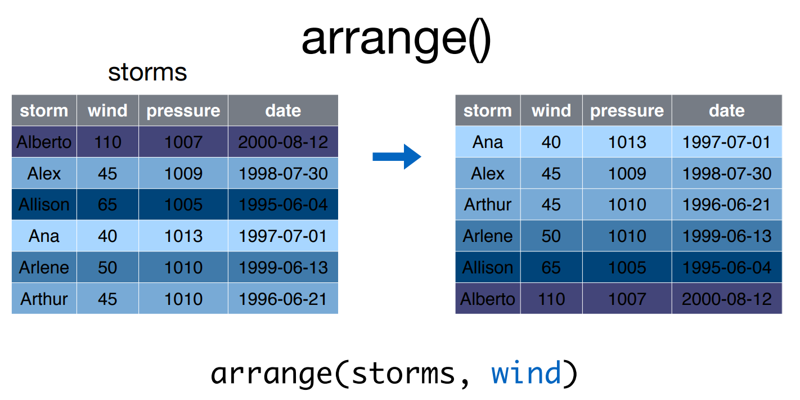
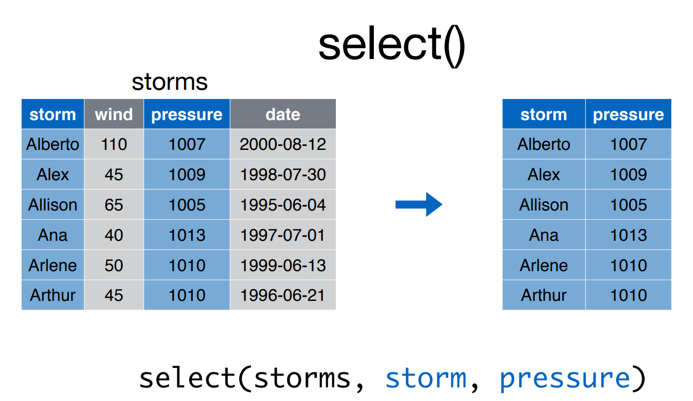
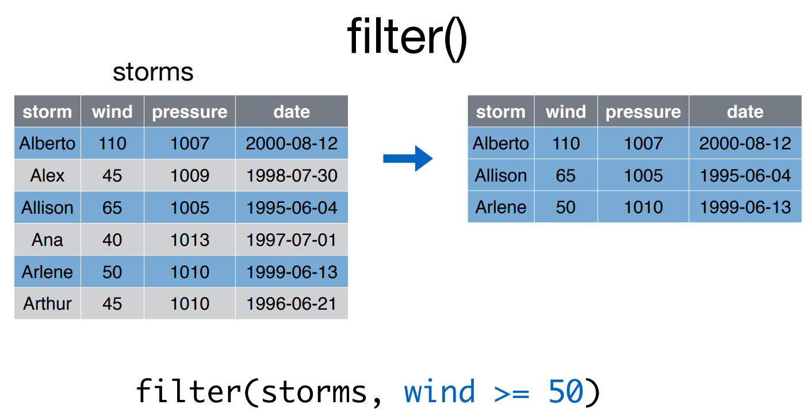
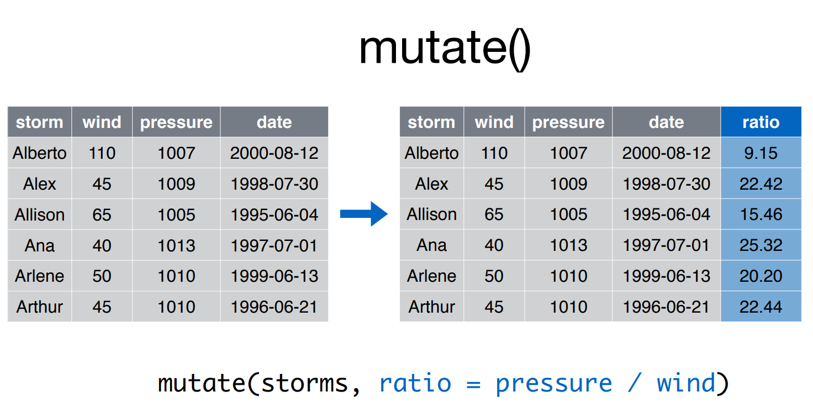
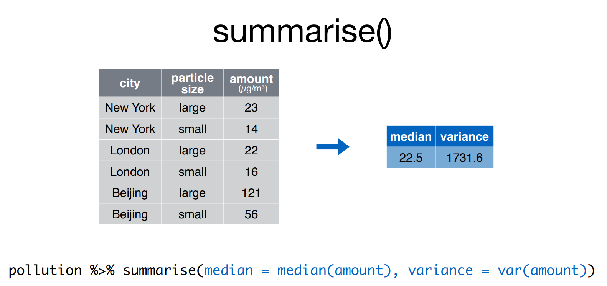

```{r include=FALSE}
knitr::opts_chunk$set(collapse = TRUE)
```

Nessa parte você aprenderá transformação de dados usando R

```{r}
knitr::include_graphics("imgs/wrangle.png")
```

Depois dessa parte, você se sentirá assim

```{r, echo=FALSE, fig.align='center'}

```

Se você não praticar, você ficará assim


```{r, echo=FALSE, fig.align='center'}

```


## Exercício 1: Setup 

1.1. Abra o arquivo `manip-script.Rmd`, dentro da pasta `aula-manip/`
1.2. Encontre a linha onde está esse exercíicio.
1.3. Coloque o cursor abaixo do 1.9.
1.4. Digite `Ctrl+Alt+I`. Isso abrirá um *chunk*. 
    - É dentro do chunk que você roda códigos R.
    - NÀO ESCREVA CÓDIGOS R FORA DOS CHUNKS
1.5. Rode `library(tidyverse)`


```{r}
library(tidyverse)
```

## O que é o tidyverse?

```{r, echo=FALSE, fig.align='center'}
knitr::include_graphics("imgs/01_tidyverse_data_science.png")
```


- Pacotes do R que facilitam a vida dos cientistas de dados.
- Integrados com o ciclo da ciência de dados.
- Construídos a partir de uma teoria comum e padronização.

Agora veremos dplyr e tidyr. Acesse https://tidyverse.org para detalhes sobre os demais.

<!-- ----------------------------------------------------------------------- -->

## Exercício 2

2.1. Qual a diferença entre uma `matrix` e um `data.frame`?

```{r}
m <- matrix(1:10, ncol = 2)
m[1,1] <- "texto"
m
```


```{r}
d <- data.frame(a = 1:5, b = 6:10)
d$a[1] <- "texto"
```


<!-- ----------------------------------------------------------------------- -->

## Revisão: RMarkdown

- Forma de escrever textos e códigos tudo junto
    - Use *chunks*: Ctrl + Alt + I
- Excelente para análises estatísticas, anotações de aulas
- Utiliza Markdown, um formato que pode virar qualquer coisa
    - `#`, `##` para títulos
    - `*`, `**`, `backtick` para negrito, itálico etc
    - `$$` para fórmulas (MathJax)
- Com RMarkdown, é possível fazer relatórios, artigos, teses, apresentações, dashboards, e sites

$$
\cup\cap\cup\cup\cap\cup\int\sum\int \;\;\;R^{md}\text{ rocks}!\;\;\;\int\sum\int\cup\cap\cup\cup\cap\cup
$$

<!-- ----------------------------------------------------------------------- -->

## Pipe `%>%`

```{r, out.width="49%", echo=FALSE}
knitr::include_graphics(c("imgs/magrittr.png", "imgs/magritte.jpg"))
```

Considere o seguinte exemplo:

```{r}
f <- function(x, y) x + y
x <- 1
y <- 2
```

As duas linhas abaixo são equivalentes:

```{r}
# caso você ainda não tenha carregado
library(tidyverse)

f(x, y)
x %>% f(y)

```

### Receita de bolo

Tente entender o que é preciso fazer. 

```{r, eval=FALSE}
esfrie(
  asse(
    coloque(
      bata(
        acrescente(
          recipiente(rep("farinha", 2), "água", 
                     "fermento", "leite", "óleo"), 
          "farinha", até = "macio"), 
        duração = "3min"), 
      lugar = "forma", tipo = "grande", 
      untada = TRUE), duração = "50min"), 
  "geladeira", "20min")
```


Desistiu? Agora veja como fica escrevendo com o `%>%`:

```{r, eval=FALSE}

recipiente(rep("farinha", 2), "água", "fermento", "leite", "óleo") %>%
  acrescente("farinha", até = "macio") %>%
  bata(duração = "3min") %>%
  coloque(lugar = "forma", tipo = "grande", untada = TRUE) %>%
  asse(duração = "50min") %>%
  esfrie("geladeira", "20min")

```

*Atalho*: %>% Ctrl + Shift + M 


Agora o código realmente parece uma receita de bolo.

Para mais informações sobre o `pipe` e exemplos de utilização, visite a página [Ceci n'est pas un pipe](http://cran.r-project.org/web/packages/magrittr/vignettes/magrittr.html).


<!-- ----------------------------------------------------------------------- -->

## Pacotes `dplyr` e `tidyr`

Dados: vamos usar o IMDB - 2016

```{r}
imdb <- read_rds("data/dados_imdb.rds")

imdb
```

```{r}
glimpse(imdb)
```


### As cinco funções principais do `dplyr`

- `select`: selecionar colunas
- `filter`: filtrar linhas
- `mutate`: criar colunas
- `arrange`: ordenar linhas
- `summarise`: sumarizar colunas

### Características do `dplyr`

- O _input_  é sempre uma `tibble`, e o _output_  é sempre um `tibble`.
- No primeiro argumento colocamos o `tibble`, e nos outros argumentos colocamos o que queremos fazer.
- A utilização é facilitada com o emprego do operador `%>%`

### arrange

```{r}

```

- Simplesmente ordena de acordo com as opções.
- Utilizar `desc()` para ordem decrescente.

```{r}
arrange(imdb, desc(imdb_score))
```

### select

```{r}

```

- Utilizar `starts_with(x)`, `contains(x)`, `matches(x)`, `one_of(x)`, etc.
- Possível colocar nomes, índices, e intervalos de variáveis com `:`.

```{r}
imdb %>% 
  arrange(desc(imdb_score)) %>% 
  select(movie_title, title_year, budget, gross)
```

### filter

```{r}

```

- Use `,` ou `&` para "e" e `|` para "ou".
- Condições separadas por vírgulas é o mesmo que separar por `&`.

```{r}
imdb %>% 
  arrange(desc(imdb_score)) %>% 
  select(movie_title, title_year, imdb_score, budget, gross) %>% 
  filter(!is.na(title_year), !is.na(gross))
```

### mutate

```{r}

```

- Aceita várias novas colunas iterativamente.
- Novas variáveis devem ter o mesmo `length` que o `nrow` do bd original ou `1`.


```{r}
imdb %>% 
  select(movie_title, director_name, title_year, imdb_score, budget, gross) %>% 
  filter(!is.na(title_year), !is.na(gross)) %>% 
  mutate(razao = gross / budget) %>% 
  arrange(desc(razao))
```

### summarise

```{r}

```

- Retorna um vetor de tamanho `1` a partir de uma conta com as variáveis.
- Geralmente é utilizado em conjunto com `group_by()`.
- Algumas funções importantes: `n()`, `n_distinct()`.


```{r}
imdb %>% 
  select(movie_title, director_name, title_year, imdb_score, budget, gross) %>% 
  group_by(director_name) %>% 
  summarise(n = n(), nota_media = mean(imdb_score, na.rm = TRUE)) %>% 
  filter(n >= 5) %>% 
  arrange(desc(nota_media))
```

## tidyr

- Até agora, estudamos os principais ferramentas de transformação de dados do `dplyr`. 
- Agora vamos aumentar nosso toolkit com `tidyr`
- O `dplyr` está para o `tidyr` assim como tesoura/cola está para um alicate/martelo.
- Enquanto o `dplyr` faz recortes na base (com `filter()`e `select()`) e adições simples (`mutate()`, `summarise()`), o `tidyr` mexe no **formato** da tabela (`gather()`, `spread()`) e faz modificações menos triviais.
- As funções do `tidyr` geralmente vêm em pares com seus inversos:
    - `gather()` e `spread()`,
    - `nest()` e `unnest()`,
    - `separate()` e `unite()`


### unite e separate

- `unite` junta duas ou mais colunas usando algum separador (`_`, por exemplo).
- `separate` faz o inverso de `unite`, e uma coluna em várias usando um separador.

### gather e spread

- `gather()` empilha o banco de dados

xxx

- `spread()` espalha uma variável nas colunas e preenche com outra variável
- spread É essencialmente a função inversa de `gather`


<!-- ----------------------------------------------------------------------- -->

### Duplicatas

Para retirar duplicatas, utilizar `distinct`. Ele considera apenas a primeira linha em que encontra um padrão para as combinações de variáveis escolhidas e descarta as demais.

```{r echo=TRUE}
decisoes %>% 
  distinct(municipio)
```

Para manter as demais colunas, use `.keep_all=`:

```{r echo=TRUE}
decisoes %>%
  distinct(municipio, camara, 
           .keep_all = TRUE)
```

Use `janitor::get_dupes()` para averiguar os casos em que há repetição de combinações de colunas.

```{r echo=TRUE}
decisoes %>% 
  get_dupes(n_processo)
```


Para mais aplicações do `janitor`, ver [este blog post](http://curso-r.com/blog/2017/07/24/2017-07-24-janitor/).

<!-- ----------------------------------------------------------------------- -->

### Joins

```{r, echo=FALSE, fig.align='center'}
knitr::include_graphics("imgs/join-venn.png")
```

Para juntar tabelas, usar `inner_join`, `left_join`, `anti_join`, etc. O melhor material disso está em http://r4ds.had.co.nz/relational-data.html.

<!-- ----------------------------------------------------------------------- -->

## Wrap-up

Hoje mexemos com importação transformação de dados

3. importação de dados
    - funções do tipo `read_*()` e `write_*()`
    - tipos de input: texto, binário, banco de dados, lista
        - excel é do tipo lista!
4. os cinco verbos do `dplyr`
    - `select()`, `filter()`, `mutate()`, `arrange()`, `summarise()`
5. as funções inversíveis do `tidyr`
    - `gather()` e `spread()`
    - `unite()` e `separate()`
6. miscelânea
    - `distinct()` para retirar duplicatas.
    - `case_when()` para reclassificações.
    - `get_dupes()` do pacote `janitor`


Na próxima vez, vamos visualizar dados com `ggplot2!`

```{r, echo=FALSE, fig.align='center'}
knitr::include_graphics("imgs/visualize.jpg")
```


